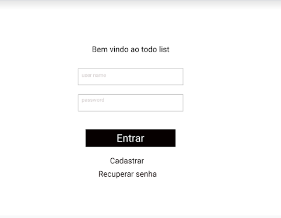
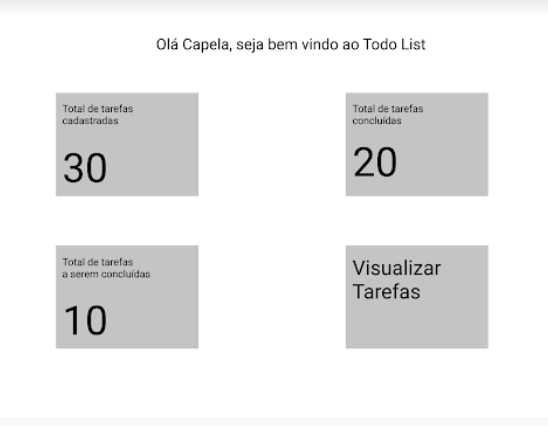
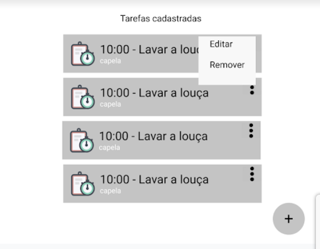
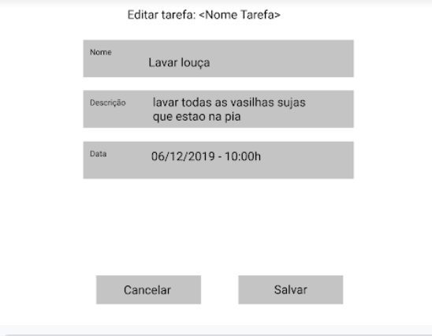
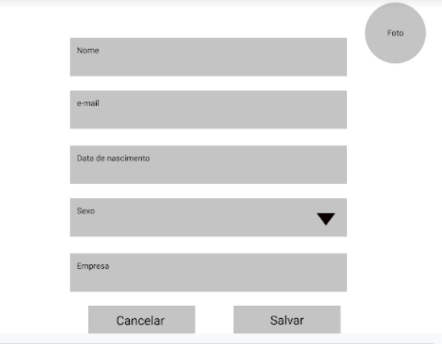

# advanced-todo

- [x] criar uma aplicação com loggin e senha;
- [x] Adicione rotas na sua aplicação utilizando o pacote React Router
- [x] O sistema deverá ter uma tela de boas vindas e pelo menos uma tela que listará as tarefas
- [x] Implemente um TodoList simples nesta tela, utilizando o pacote Material-UI

  - [x] implementada com o componente List
  - [x] exibindo um ícone, o nome da tarefa no texto primário e o nome do usuário que criou a tarefa no texto secundário
  - [x] Todos os demais componentes utilizados na interação com o usuário deverão ser do pacote Material-UI

  Na lista de tarefas

  - [x] deve conter um botão de ícone para removê-la e outro para editá-la.
  - [ ] tela de edição
    - [ ] editar as informações da sua tarefa e salvar essa alteração, retornando para a tela anterior.
          2 estados:
      - visualização;
      - edição.

informações da tarefa:

- Nome;
- Descrição;
- Situação;
  - Cadastrada;
  - Em andamento;
  - Comcluída.  
    **NOTA:** Na tela de visualização deve existir um comando que passa a tarefa de Cadastrada para Em Andamento, um que passa a tarefa de Em Andamento para Concluída e um outro que passa a tarefa para Cadastrada, independente do estado que ela esteja. Lembre-se de deixar o comando desabilitado quando não for possível realizar uma transição (Exemplo: O usuário não pode clicar na ação Concluir sem que a tarefa esteja na situação Em Andamento)
- Data;
- e usuários que criou a tarefa.

- [ ] somente o usuário que criou a tarefa consiga alterá-la ou excluí-la, no entanto todos podem vê-la.
- [ ] Altere o sistema para permitir que seja informada se a tarefa é pessoal ou não. Neste caso, se for uma tarefa pessoal, somente o usuário que criou a tarefa pode vê-la. _Trate essa restrição de visibilidade através da **publicação do Meteor**_.
- [ ] user profile com os seguintes campos:
  - Nome,
  - Email,
  - Data de Nascimento,
  - Sexo (utilizando combobox/selects),
  - Empresa que trabalha e
  - Foto (A foto deve ser salva em banco de dados utilizando base64).
- [ ] Drawer com dois links, um para acessar a lista de tarefas e outro para acessar os dados do usuário logado. Os dados (foto, nome e email) do usuário logado devem estar visíveis na parte de cima do Drawer.
- [ ] Altere a tela de boas vindas, que é apresentada quando o usuário faz login, para exibir um Dashboard das tarefas contendo as informações (que podem ser implementadas com cards): Total de Tarefas Cadastradas, Total de Tarefas em Andamento e Total de Tarefas Concluídas. Nesse dashboard deve ter também uma ação para acessar a lista com todas as tarefas.

## EXTRAS

- [ ] Ajuste visualmente sua aplicação para exercitar seus conhecimentos de CSS e criação de componentes REAC
- [ ] Na lista de tarefas deve ser inserido um checkbox que permite exibir também as tarefas concluídas. Quando ele está desmarcado é para exibir somente as tarefas nas situações “Cadastrada” e “Em Andamento”. (Sugestão: Utilize ReactiveVar do Meteor)
      **ATENÇÃO:** O filtro deve ser feito do lado do servidor, utilizando as publicações do meteor
- [ ] Crie uma “campo de pesquisa” que permite filtrar as tarefas de acordo com o texto indicado. O Filtro deverá ser pelo nome da tarefa.
      Devem ser retornadas tanto das tarefas pessoas(do usuário logado) quanto as tarefas públicas.
      **ATENÇÃO:** O filtro deve ser feito do lado do servidor, utilizando as publicações do meteor
- [ ] Adicione paginação na lista sde tarefas. O tamanho máximo da página deve ser de 4 tarefas por página.
      **Observação:** Utilize SKIP e LIMIT nas pesquisas via MongoDB.
      **ATENÇÃO:** O filtro deve ser feito do lado do servidor, utilizando as publicações do meteor.

## TELAS

Login:

Dashboard:

Todo List:

Edit Todo List:

Profile:

